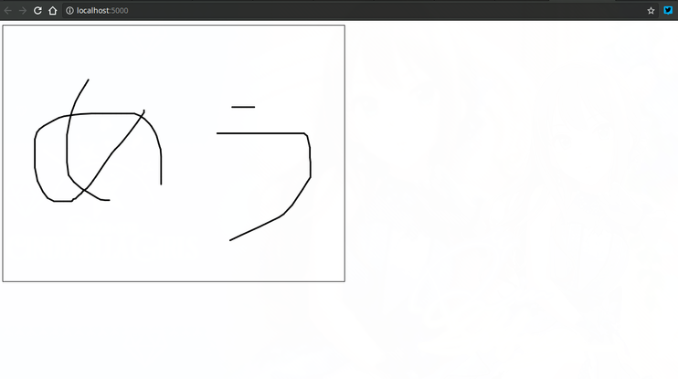
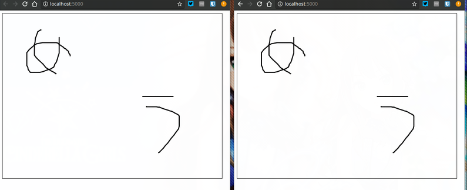

# ASP .NET Core + SignalR + p5.jsを使ってホワイトボードを作ってみるお話
この記事は、[FUN Advent Calendar 2017](https://adventar.org/calendars/2106) 10日目の記事です。

**概要**
最近リリースされたASP .NET Core用の双方向通信ライブラリ「SignalR」の紹介の為、本学生なら一度は触っている「Processing」をJavaScriptに移植した「p5.js」を使って簡単なWebホワイトボードを作ってみます。


## 自己紹介
- [無気力系幼女の不知火ちゃん@shirasayav5](https://twitter.com/shirasayav5/)
- B1
- C#すき
- Arch Linux系のManjaroをメインに使ってる
- デレマスはしぶりん・ありすP

## 今回作るもの
- オンラインホワイトボード
- サイトを開いている人が全員同じ絵を見たり書き込んだり出来る
- 超超簡易Realtime Board的な物
- 双方向通信ライブラリにASP .NET Core SignalRを使う
- 画面描画ライブラリにp5.jsを使う

尚、実装の簡易化の為、絵については「１つ前のフレームのマウス座標から現在のフレームのマウス座標まで直線を引いた物」とします。

## 今回使う技術について
全てMicrosoft社製のオープンソースライブラリです
### .NET Core
- クロスプラットフォームで.NETの開発・実行環境。
- MacやLinuxではコンソールアプリしか作れない為サーバーサイドの利用が多い。
- 最新のメジャーバージョンである、2.0リリースは2017年8月14日
### ASP .NET Core
- .NET Core上で動くオープンソースのWebフレームワーク。
- ASP .NETの.NET Coreへの移植版。
- もちろんLinuxでも動く。もちろんDockerコンテナもあるよ ~~(容量大きい……大きくない？)~~
- 最近のメジャーアップデートである、バージョン2.0リリースは2017年8月14日(.NET Coreと連動)
### ASP .NET Core SignalR
- ASP .NET Core上で動く、クライアントとサーバーとの双方向通信ライブラリ
- ASP .NET SignalRの移植版
- WebSocketsやServer-Sent Events、ロングポーリング等をラップして、最適な物を用いて双方向通信を行う
- RPCスタイルのAPIを採用しているのが特徴
- サーバーとクライアントがそれぞれメソッドを持っていて、相互に呼び出しているイメージ
- サーバーにC#やF#等、クライアントにJavaScriptやC#等を使う事が出来る
- 現在アルファ版段階で、最新版リリースは2017年9月14日

## 環境構築
### .NET Coreを入れてみる
https://github.com/dotnet/core/blob/master/release-notes/download-archive.md  
ここから最新のバージョンを選択、お使いのOSの通りにインストールしてください。  
Arch Linuxをお使いの方はAURに[dotnet-sdk-2.0](https://aur.archlinux.org/packages/dotnet-sdk-2.0/)があるので、yaourtかなんかで入れて下さい。  
~~Community入りして欲しいなぁ(願望)~~

### 一応Hello Worldしてみる
```bash
mkdir helloworld_dotnet
cd helloworld_dotnet
dotnet new console
dotnet run
```
Hello Wolrdが表示されればおっけーです

### Webのテンプレを用意する
適当なフォルダにて
```bash
mkdir whiteboard_signalr
cd whiteboard_signalr
dotnet new web
```
`dotnet new`でテンプレートを用いてプロジェクトを作ってくれます。  
今回はSingalRだけ使うので空のASP .NET Coreテンプレートを示す`web`で十分です。
### SignalRライブラリを入れる
.NETではライブラリ管理に[nuget](https://www.nuget.org/)を用います。  
.NET CoreではCLIで管理できるようになっています。  
というわけでサクッと双方向通信ライブラリ、SignalRを追加しましょう
```
dotnet add package Microsoft.AspNetCore.SignalR --version 1.0.0-alpha2-final
```

## 実際に作ってみる(クライアントサイド・画面描画編)
```bash
cd wwwroot
```
wwwrootフォルダに移動して、そこで好きなエディタを使って書いて下さい
### p5.jsを使ってホワイトボードを作ってみる
とりあえず下地となるHTMLファイルを作ります
```html:index.html
<!DOCTYPE html>
<html>

<head>
    <meta charset="utf-8" />
    <meta name="viewport" content="width=device-width, initial-scale=1.0">
    <!-- ↓SignalR↓ -->
    <script type="text/javascript" src="signalr-client-1.0.0-alpha2-final.min.js"></script>
    <!-- ↓p5.js↓ -->
    <script type="text/javascript" src="https://cdnjs.cloudflare.com/ajax/libs/p5.js/0.5.16/p5.js"></script>
    <script type="text/javascript" src="https://cdnjs.cloudflare.com/ajax/libs/p5.js/0.5.16/addons/p5.dom.min.js"></script>
    <!-- ↓これから書くスクリプト↓ -->
    <script type="text/javascript" src="sketch.js"></script>
    <title>Whiteboard_signalr_p5</title>
</head>

<body>
<!-- ※今回はp5.jsでcanvasを作ります-->
</body>

</html>
```
ホワイトボードを実装してみます
```javascript:sketch.js
function setup(){
    createCanvas(640, 480); //Canvas作る
    rect(0, 0, 639, 479); //Canvasの枠線
    frameRate(30); //フレームレートを下げる
    strokeWeight(3); //線を太くする
}
let past_x = 0; //1つ前のフレーム時のマウスのX座標
let past_y = 0; //1つ前のフレーム時のマウスのY座標

function draw(){
    if (mouseIsPressed){
        drawLineonSelf(); //マウスが押されている間描画
        past_x = mouseX;
        past_y = mouseY;
    }
}
function mousePressed(){
    past_x = mouseX;
    past_y = mouseY;
}
function drawLineonSelf(){
    //1つ前のフレーム時の座標から、現在のフレーム時のマウス座標まで、直線を書く
    if (past_x != mouseX || past_y != mouseY){
        line(mouseX, mouseY, past_x, past_y);
    }
}
```
これでお絵かきするキャンバスが出来ました。  
ファイルを開いてマウスドラッグするとお絵かき出来ます

## 実際に作ってみる(サーバーサイド)

### Hubを定義する
HubはSignalRにおいて、APIのエンドポイントであり、何か処理をしてクライアントのメソッドを呼び出すサーバーとなる物です  
（良い説明が思い浮かばない……。Microsoftのドキュメントには
「Provides methods that communicate with SignalR connections that connected to a Hub」とあります）

今回は、「接続しているクライアントに、お絵かき中の（マウスドラッグしている）クライアントから『1つ前のフレーム時のマウス座標と現在のマウス座標』を受信し、他のクライアントにブロードキャストするHub」を定義します。

`whiteboard_signalr`フォルダに移動して、適当に新規作成して下さい

```cs:Whiteboard.cs
using System.Collections.Generic;
using System.Threading.Tasks;
using Microsoft.AspNetCore.SignalR;
namespace whiteboard_signalr
{
    public class WhiteboardHub : Hub //Hubクラスを継承しています
    {
        public Task Draw_Server(int prevX, int prevY, int currentX, int currentY)
        {
            // 送ってきたクライアント以外のクライアントに、データを送信します
            // this.Context.ConnectionIdがリクエストを送ってきたクライアントです
            
            // InvokeAsync(string: クライアントのメソッド名, object:送るデータ)
            return Clients.AllExcept(new List<string> { this.Context.ConnectionId }).InvokeAsync("draw_client", prevX, prevY, currentX, currentY);
        }
    }
}
```
後はStartup.csにSignalRを使う設定を書き足すだけ
```cs:startup.cs
using System;
using System.Collections.Generic;
using System.Linq;
using System.Threading.Tasks;
using Microsoft.AspNetCore.Builder;
using Microsoft.AspNetCore.Hosting;
using Microsoft.AspNetCore.Http;
using Microsoft.Extensions.DependencyInjection;

namespace whiteboard_signalr
{
    public class Startup
    {
        public void ConfigureServices(IServiceCollection services)
        {
            services.AddSignalR(); //追加
        }

        public void Configure(IApplicationBuilder app, IHostingEnvironment env)
            {
                if (env.IsDevelopment())
                {
                    app.UseDeveloperExceptionPage();
                }
                app.UseFileServer(); //静的ファイルを配信する用。wwwrootディレクトリにあるファイルをルーティングしてくれる
                app.UseSignalR(routes => //追加
                {
                    routes.MapHub<WhiteboardHub>("draw");
                });
            }
    }
}
```
## 実際に作ってみる(クライアントサイド・双方向通信編)
### SignalRのJSクライアントライブラリを入手する
npmで配信されているSignalRのクライアントライブラリを入手します  
適当なフォルダにて
```bash
npm install @aspnet/signalr-client
```
`node_modules/@aspnet/signalr-client/dist/browser/signalr-client-1.0.0-alpha2-final.min.js`がSignalRのJSクライアントなので、プロジェクトフォルダの`wwwroot`にコピーして下さい
### SignalRのJSクライアントライブラリを使ってみる
```javascript:canvas.js
let connection;
function setup() {
    createCanvas(640, 480);
    rect(0, 0, 639, 479);
    frameRate(30);
    strokeWeight(3);
    // ↓追加↓
    connection = new signalR.HubConnection('/draw');
    //↓クライアントのdraw_clientメソッドの定義。draw_clientメソッドでメッセージが来たら実行する
    connection.on('draw_client', function (prev_x, prev_y, x, y) {
        line(prev_x, prev_y, x, y)
    });
    connection.start(); //接続開始
    // ↑ここまで↑
}
let past_x = 0;
let past_y = 0;

function draw() {
    if (mouseIsPressed) {
        drawLineonSelf();
        past_x = mouseX;
        past_y = mouseY;
    }
}
function mousePressed() {
    past_x = mouseX;
    past_y = mouseY;
}
function drawLineonSelf() {
    if (past_x != mouseX || past_y != mouseY) {
        line(mouseX, mouseY, past_x, past_y);
        //サーバーのdraw_serverメソッドを呼び出します
        connection.invoke('draw_server', past_x, past_y, mouseX, mouseY);
    }
}
```
## 動かしてみる
これで完成です。実際にブラウザを２つ立ち上げて、`localhost:5000`にアクセスし、キャンバスの中でマウスドラッグしてお絵描きしてみると、ほぼ同時にもう片方に反映されると思います。




## 終わりに
SignalRを使う事で、簡単に双方向通信を書く事が出来ました。  
今回の記事で書いたソースコードは[こちら](https://github.com/ShiranuiNui/FUN_AdC_2017_Day10/tree/master/Samples)にあります。  

もちろんASP .NET Coreは双方向通信ライブラリだけではなく、MVC用のルーティングやビューを作ってくれるライブラリ、認証ライブラリ等様々なライブラリがMicrosoftによって作られています。  

ASP .NET Coreのリリースにより以前よりぐっとサーバーサイドC#の可能性が広がりました。  
この記事をきっかけに、サーバーサイドC#の世界に興味がある方が1人でもいれば幸いです。  
**みんなC#をやろう（提案）**

## おまけ
今回作ったサンプルは機能が少なくて寂しいので、
- 書いたデータをORマッパーを使いDBに保存する
- 接続時にデータを渡す
- 消去ボタンを追加する

の機能を加えたちょっと改良版を[GitHub](https://github.com/ShiranuiNui/Whiteboard_SignalR_p5)、および[shiranuisayaka.net](http://shiranuisayaka.net/whiteboard/)に公開しています。よろしければそちらでも遊んでみて下さい  

明日はichiren1さんです